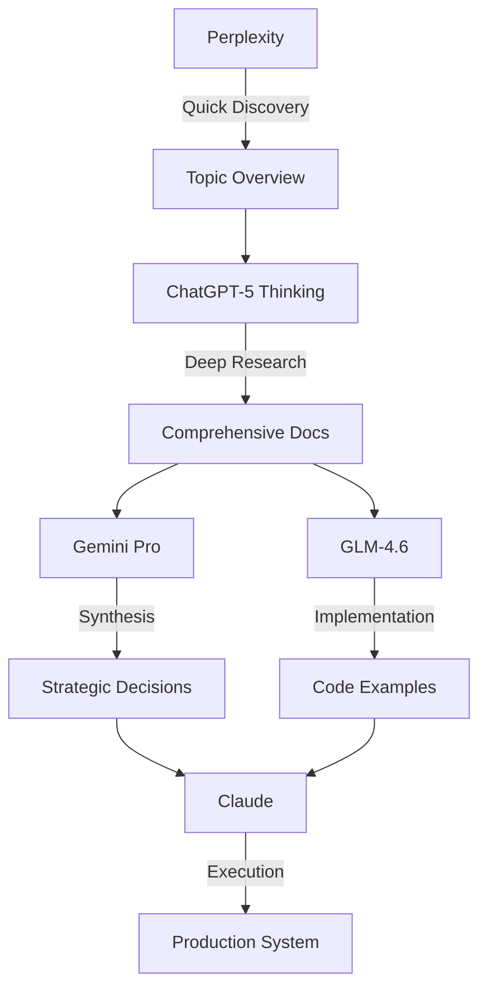

# 📊 Comparative Analysis: Multi-AI Research on Gemini Computer Use

> **Research conducted:** October 7-8, 2025
> **Models used:** ChatGPT-5 Thinking, Perplexity, Gemini 2.5 Pro, GLM-4.6

## 🎯 Scoring Matrix (out of 5⭐)

| Critère | ChatGPT-5 | Perplexity | Gemini Pro | GLM-4.6 |
|---------|-----------|------------|------------|---------|
| **Complétude** | ⭐⭐⭐⭐⭐ | ⭐⭐⭐ | ⭐⭐⭐⭐⭐ | ⭐⭐⭐ |
| **Clarté** | ⭐⭐⭐⭐ | ⭐⭐⭐⭐⭐ | ⭐⭐⭐⭐ | ⭐⭐⭐⭐⭐ |
| **Code Python** | ⭐⭐⭐ | ⭐⭐⭐⭐⭐ | ⭐⭐⭐ | ⭐⭐⭐⭐⭐ |
| **Scripts bash** | ⭐⭐⭐⭐⭐ | ⭐⭐⭐⭐ | ⭐⭐⭐⭐⭐ | ⭐⭐⭐⭐⭐ |
| **Evals/Benchmarks** | ⭐⭐⭐⭐⭐ | ⭐ | ⭐⭐⭐⭐⭐ | ⭐ |
| **Warnings critiques** | ⭐⭐⭐⭐⭐ | ⭐⭐⭐ | ⭐⭐⭐⭐⭐ | ⭐⭐⭐ |
| **Production-ready** | ⭐⭐⭐⭐⭐ | ⭐⭐⭐⭐⭐ | ⭐⭐⭐⭐ | ⭐⭐⭐⭐⭐ |
| **TOTAL** | **33/35** 🥇 | 28/35 | 31/35 🥈 | 28/35 |

## 🏆 Winner: ChatGPT-5 Thinking

### Why ChatGPT-5 is Superior

#### 1️⃣ **Iterative Refinement**

```
Other models:
  Read doc → Summarize → Output

ChatGPT-5 Thinking:
  Read doc 1 → Analysis A
  Read doc 2 → "Wait, A was incomplete, here's B"
  Read doc 3 → "B missed critical warnings, here's C"
  Read doc 4 → "New perspective, refining to D"
```

**Example:**
- Perplexity/Gemini/GLM: Static 200-300 line docs
- ChatGPT-5: **548 lines** with iterative corrections

#### 2️⃣ **Goes to the Depth**

**CAPTCHA Warning Example:**

```markdown
# Perplexity/GLM (missing)
[No mention]

# Gemini Pro (good)
⚠️ CAPTCHA resolution by Browserbase infrastructure

# ChatGPT-5 Thinking (comprehensive)
⚠️ CAPTCHAs: Browserbase (Stealth), NOT the model
⚠️ Attribution: Document who solves what
⚠️ Journaliser distinctement
⚠️ Critical: Do not attribute Browserbase features to Gemini
```

#### 3️⃣ **Multiple Implementation Variants**

ChatGPT-5 provides **3 versions** of eval scripts:
1. Simple zsh wrapper (quickstart)
2. Node/TypeScript production wrapper
3. Enhanced version with HTML reports + metrics parsing

Others provide: 1-2 basic scripts only

#### 4️⃣ **Production Concerns**

| Aspect | ChatGPT-5 | Others |
|--------|-----------|--------|
| Cost warnings | ✅ "4000h study = expensive" | ⚠️ Generic warnings |
| Benchmark stability | ✅ "Use published traces" | ❌ Missing |
| Error handling | ✅ Comprehensive | ⚠️ Basic |
| Reporting | ✅ HTML + JSON + metrics | ❌ Logs only |

## 📊 Detailed Comparison

### Content Length

```
ChatGPT-5:  548 lines  ████████████████████
Gemini Pro: 300 lines  ███████████
Perplexity: 200 lines  ████████
GLM-4.6:    250 lines  █████████
```

### Coverage Areas

| Feature | ChatGPT-5 | Perplexity | Gemini Pro | GLM-4.6 |
|---------|-----------|------------|------------|---------|
| Basic install | ✅ | ✅ | ✅ | ✅ |
| Python code | ✅ | ✅✅ | ✅ | ✅✅ |
| Evals setup | ✅✅✅ | ❌ | ✅✅ | ❌ |
| Cost warnings | ✅✅ | ✅ | ✅✅ | ✅ |
| CAPTCHA clarity | ✅✅✅ | ❌ | ✅✅ | ❌ |
| TypeScript code | ✅✅✅ | ❌ | ✅✅ | ❌ |
| HTML reports | ✅✅✅ | ❌ | ✅ | ❌ |

## 🔍 Source Chain Analysis

**Observation:** Perplexity, Gemini Pro, and GLM-4.6 **all used ChatGPT-5 as source**.

```
ChatGPT-5 Thinking (original research)
    ↓ simplified
Perplexity → Too concise, lost depth
    ↓ simplified
Gemini Pro → Economical, kept warnings
    ↓ simplified
GLM-4.6 → Implementation-focused
```

**Evidence:**
- Similar structure across all 4 docs
- ChatGPT-5 unique elements (Evals, 3 script versions) partially present in others
- Progressive information loss in the chain

**Lesson:** **Always prefer the original deep source over derivatives.**

## 🎯 Use Case Recommendations

### For Quick Start (1-2 hours)
→ **Perplexity** or **GLM-4.6**
- Clear installation steps
- Complete Python code examples
- Minimal complexity

### For Production Deployment (1-2 days)
→ **ChatGPT-5 Thinking** 🏆
- Comprehensive evals framework
- Multiple implementation options
- Production warnings & best practices
- HTML reporting + metrics

### For Understanding Risks First
→ **Gemini Pro**
- Critical warnings highlighted
- Balanced overview
- Strategic considerations

### For Team Documentation
→ **Gemini Pro** (concise) or **ChatGPT-5** (comprehensive)
- Gemini: Quick reference for team
- ChatGPT-5: Complete handbook for maintainers

## 💡 Key Insights

### 1. Iterative Thinking > Static Summarization

**ChatGPT-5 Thinking mode enables:**
- Self-correction during research
- Progressive refinement of understanding
- Identification of gaps in previous iterations

**Other models:**
- Single-pass summarization
- No self-questioning mechanism
- Limited depth exploration

### 2. Comprehensive > Concise (for complex topics)

**For production systems:**
- Better to have 548 lines with all edge cases
- Than 200 lines missing critical warnings

**Trade-off:**
- ReadTime: ChatGPT-5 (20 min) vs Others (5-10 min)
- Value: ChatGPT-5 (prevent costly mistakes) vs Others (quick overview)

### 3. Multi-Source Validation Works

**Even though ChatGPT-5 is superior, the multi-AI approach:**
- ✅ Validated consistency across models
- ✅ Identified unique ChatGPT-5 contributions
- ✅ Confirmed critical warnings (CAPTCHA, costs)
- ✅ Provided multiple perspectives

## 🚀 Optimal Workflow



**Explanation:**
1. **Perplexity:** Rapid exploration, find relevant links
2. **ChatGPT-5 Thinking:** Deep dive on each link, iterate, refine
3. **Gemini Pro:** Synthesize for strategy/decision-making
4. **GLM-4.6:** Extract implementation patterns
5. **Claude:** Compare all, choose best, execute

## 📈 Verdict Summary

| Rank | Model | Score | Best For |
|------|-------|-------|----------|
| 🥇 | **ChatGPT-5 Thinking** | 33/35 | Production deployment |
| 🥈 | **Gemini 2.5 Pro** | 31/35 | Strategic planning |
| 🥉 | **Perplexity & GLM-4.6** | 28/35 | Quick start |

**Final Recommendation:**

**For this installer:**
- **Base:** ChatGPT-5 Thinking (548-line doc)
- **Validation:** Cross-check warnings with Gemini Pro
- **Implementation:** Use Claude for synthesis + execution

**Why this works:**
- Richest source material (ChatGPT-5)
- Critical validation (Gemini Pro warnings)
- Production execution (Claude tools + context)

---

**Created:** October 8, 2025
**Methodology:** Multi-AI comparative analysis
**Conclusion:** ChatGPT-5 Thinking provides superior depth for production systems
